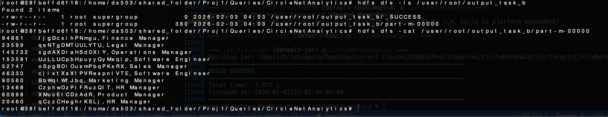

<h1>1. Data Loading Portion</h1>

<b>Krishna</b> - I made three dataframes with the proper constraints and specifications outlined by the document. This was the fastest way I could figure out how to do it. It is in fact slow and the follows.csv does take about a gigabyte of space of your RAM, so be careful opening it up. The values are fairly realistic except maybe 

<b>AI Usage</b> - AI was used in understanding the concepts of MapReduce and also gave me the boiler template for MapReduce functions. Logic was completely done without AI.


<h1>2. Loading Into Hadoop</h1>
Krishna -


<h1>3. Queries</h1>
Installed Maven project using this command:

```shell
mvn archetype:generate -DgroupId=com.krishnagarg.proj1 -DartifactId=CircleNetAnalytics -DarchetypeArtifactId=maven-archetype-quickstart -DinteractiveMode=false
```

<h1>Task A - Report the frequency of each favorite hobby (FavoriteHobby) on CircleNet</h1>

```bash
root@38fbeffd6f18:/home/ds503/shared_folder/Proj1/Queries/CircleNetAnalytics/target hdfs dfs -cat /user/root/output_A/part-r-00000 | head -n 10
Astronomy	7017
Baking	7223
Bird Watching	7080
Calligraphy	7104
Chess	6960
Cooking	7342
Cycling	7127
Dancing	7096
Fishing	7129
Gardening	7013
```

<div>
    <h2>What I Did (Basic Solution)</h2>
    <p>I made a mapper function that associates each Favorite Hobby (key) with the number one. Then in the mapper, I sum up the list of values with the associated distinct key. The key value pairs were shuffled and sorted automatically.</p>
    <h2>Optimization I Tried (Advanced Solution)</h2>
    <p>A more optimized solution would be one that implements a combiner since from the mapper a key value pair of (Reading, 1) would be going across the network to the reducer. Instead of summing up the values in the list (since they are all 1) in the reducer we could take care of the big chunk of the processing in the combiner. So I just made my reducer my combiner as well since it may or may not get used. So this is the optimal solution</p>
    <b>Did I succeed? YES</b>
</div>

<h1>Task B - Find the 10 most popular CircleNetPages, namely, those that got the most accesses based on the ActivityLog among all pages. Return ID, NickName, and JobTitle.</h1>



<div>
    <h2>What I Did (Basic Solution)</h2>
    <p>I broke this function down to three jobs. The first gets the number of instances of each page visit. It will return (PageID, # of occurrences). The second job sorts the output from the first job to find the top 10 pages. The third job gets the information for those pages from the CircleNetPage csv.</p>
    <h2>Optimization I Tried (Advanced Solution)</h2>
    <p></p>
    <b>Did I succeed? YES</b>
</div>


<h1>Task C - Report all CircleNetPage users (NickName, and JobTitle) whose hobby (FavoriteHobby)
is the same as your own (pick one). Note that the favorite hobby in the data file may be random sequence of characters unless you work with meaningful strings like “Reading”
or “Basketball”. This is up to you.</h1>


<div>
    <h2>What I Did (Basic Solution)</h2>
    <p>This was a simple mapping problem. I filtered the users csv by a hobby, "Reading", and just returned the requested fields. This is the optimal solution as I am not using a reducer and only a mapper.</p>
    <h2>Optimization I Tried (Advanced Solution)</h2>
    <p>Didn't use a reducer and only used a mapper in the appropriate places. No need for a combiner of any kind.</p>
    <b>Did I succeed? YES</b>
</div>


<h1>Task F- Report all owners of a CircleNetPage who are more popular than an average user, namely, 
those who have more followers than the average number of followers across all owners of a CircleNetPage.</h1>

<div>
    <h2>What I Did (Basic Solution)</h2>
    <p></p>
    <h2>Optimization I Tried (Advanced Solution)</h2>
    <p></p>
</div>


<h1>Task G- Identify "outdated" CircleNetPages. Return IDs and nicknames of persons that have not accessed 
CircleNet for 90 days (i.e., no entries in the ActivityLog in the last 90 days).</h1>

<div>
    <h2>What I Did (Basic Solution)</h2>
    <p></p>
    <h2>Optimization I Tried (Advanced Solution)</h2>
    <p></p>
</div>

<h1>Task H- Identify all those people who follow somebody’s CircleNetPage in their same RegionCode 
but are not being followed back. Report IDs and nicknames.</h1>

<div>
    <h2>What I Did (Basic Solution)</h2>
    <p></p>
    <h2>Optimization I Tried (Advanced Solution)</h2>
    <p></p>
</div>

