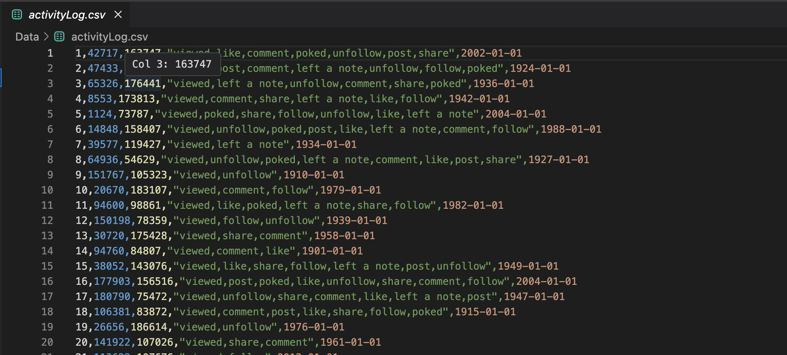
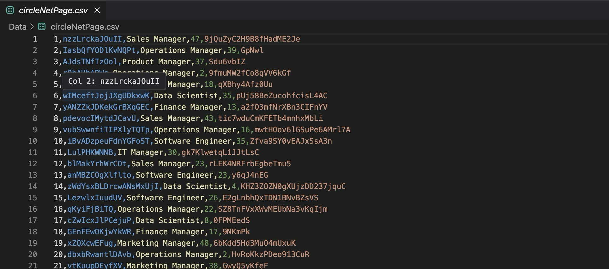
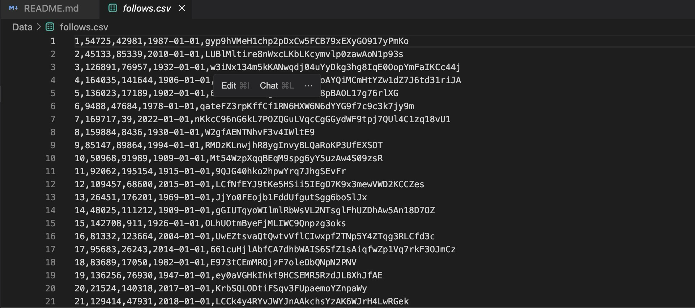

<h1>Data Loading Portion</h1>

<b>Krishna</b> - I made three dataframes with the proper constraints and specifications outlined by the document. This was the fastest way I could figure out how to do it. It is in fact slow and the follows.csv does take about a gigabyte of space of your RAM, so be careful opening it up. The values are fairly realistic except maybe 

